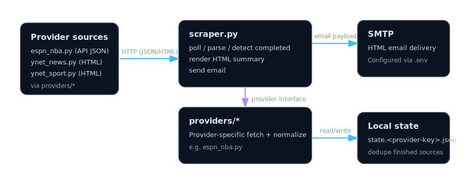

# Scraper Agent

A Python agent that continuously scrapes data from multiple pluggable providers, detects new/completed items, and emails a summary table.

## Features

- Supports multiple providers via `providers/*` (e.g. `espn_nba`, `ynet_news`, `ynet_sport`, `email_url_summary`)
- Fetches data from provider sources (API JSON / HTML)
- Displays scores, odds, venue, broadcast info, and player leaders in the console
- Tracks completed games between checks using a local `state.<provider-key>.json` file
- Sends an HTML email with a formatted summary table when new items are detected

## Architecture



## Quick Start (WSL)

```bash
# 1. Navigate to the project
cd /mnt/c/Projects/python/Scraper

# 2. Make scripts executable & run setup
chmod +x setup.sh run.sh
./setup.sh

# 3. Edit .env with your SMTP credentials
nano .env

# 4. Run the agent
./run.sh          # continuous loop (default: every 5 minutes)
./run.sh once     # single check
```

## Email Configuration

The agent uses SMTP to send emails. For **Gmail**, create an [App Password](https://support.google.com/accounts/answer/185833) and set it in `.env`:

| Variable         | Description                           |
| ---------------- | ------------------------------------- |
| `SMTP_HOST`      | SMTP server (default: smtp.gmail.com) |
| `SMTP_PORT`      | SMTP port (default: 587)              |
| `SMTP_USER`      | Your email address                    |
| `SMTP_PASS`      | App password                          |
| `EMAIL_TO`       | Recipient email                       |
| `CHECK_INTERVAL` | Seconds between checks (default: 300) |

### Email URL Summary provider (IMAP)

The `email-url-summary` provider polls an IMAP inbox for unread emails (optionally filtered by sender), extracts URLs from the email body, fetches each URL, summarizes the text, and emails a table.

| Variable                            | Description                                                    |
| ----------------------------------- | -------------------------------------------------------------- |
| `IMAP_HOST`                         | IMAP host (e.g. `imap.gmail.com`)                              |
| `IMAP_PORT`                         | IMAP port (default: `993`)                                     |
| `IMAP_USER`                         | IMAP username/email                                            |
| `IMAP_PASS`                         | IMAP password (for Gmail: App Password)                        |
| `IMAP_FOLDER`                       | Mailbox folder (default: `INBOX`)                              |
| `EMAIL_POLL_FROM`                   | Only process emails from this sender (optional)                |
| `EMAIL_POLL_MARK_SEEN`              | Mark processed emails as seen (default: `true`)                |
| `EMAIL_POLL_MAX_EMAILS`             | Max emails to process per poll (default: `10`)                 |
| `CHECK_INTERVAL__EMAIL_URL_SUMMARY` | Provider-specific poll interval in seconds (recommended: `30`) |

## Files

| File                             | Purpose                                 |
| -------------------------------- | --------------------------------------- |
| `scraper.py`                     | Main agent (scrape, detect, email)      |
| `providers/espn_nba.py`          | ESPN NBA provider                       |
| `providers/email_url_summary.py` | Email URL summary provider (IMAP inbox) |
| `providers/ynet_news.py`         | Ynet news provider                      |
| `providers/ynet_sport.py`        | Ynet sport provider                     |
| `setup.sh`                       | One-time environment setup              |
| `run.sh`                         | Launch the agent                        |
| `.env.example`                   | Template for environment variables      |
| `state.<provider-key>.json`      | Auto-created runtime state              |
| `requirements.txt`               | Python dependencies                     |
